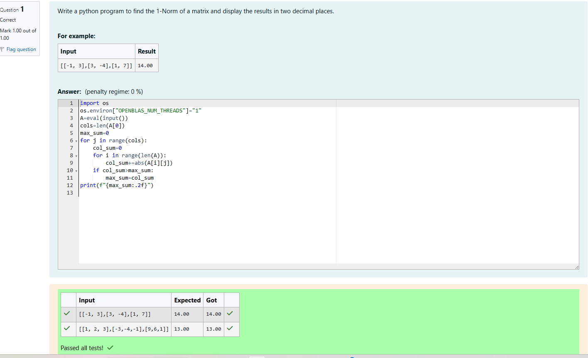
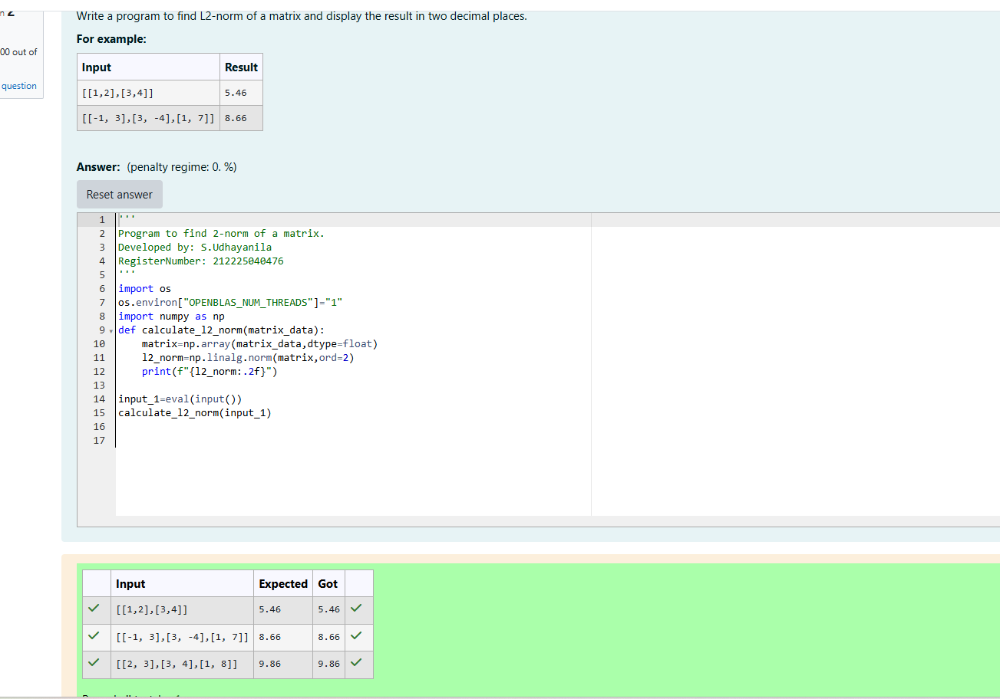
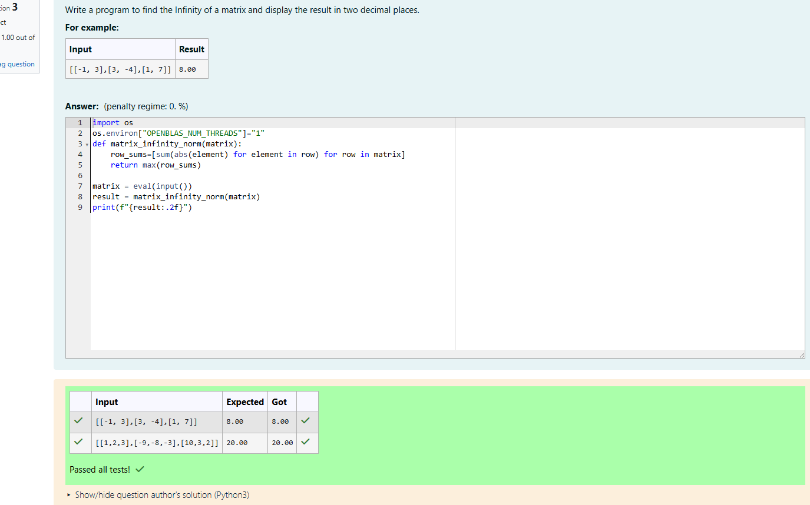

# Norm of a matrix
## Aim
To write a program to find the 1-norm, 2-norm and infinity norm of the matrix and display the result in two decimal places.
## Equipment’s required:
1.	Hardware – PCs
2.	Anaconda – Python 3.7 Installation / Moodle-Code Runner
## Algorithm:
	1. Get the input matrix using np.array()   
    2. Find the 2-norm of the matrix using np.linalg.norm()
	3. Print the norm of the matrix in two decimal places.
## Program:
```Python
# Register No:212225040476
# Developed By:S.Udhayanila
# 1-Norm of a Matrix
import os
os.environ["OPENBLAS_NUM_THREADS"]="1"
A=eval(input())
cols=len(A[0])
max_sum=0
for j in range(cols):
    col_sum=0
    for i in range(len(A)):
        col_sum+=abs(A[i][j])
    if col_sum>max_sum:
        max_sum=col_sum
print(f"{max_sum:.2f}")
 
# 2-Norm of a Matrix

import os
os.environ["OPENBLAS_NUM_THREADS"]="1"
import numpy as np
def calculate_l2_norm(matrix_data):
    matrix=np.array(matrix_data,dtype=float)
    l2_norm=np.linalg.norm(matrix,ord=2)
    print(f"{l2_norm:.2f}")
    
input_1=eval(input())
calculate_l2_norm(input_1)

# Infinity Norm of a Matrix
import os
os.environ["OPENBLAS_NUM_THREADS"]="1"
def matrix_infinity_norm(matrix):
    row_sums=[sum(abs(element) for element in row) for row in matrix]
    return max(row_sums)
    
matrix = eval(input())
result = matrix_infinity_norm(matrix)
print(f"{result:.2f}")
```
## Output:
### 1-Norm of a Matrix


### 2-Norm of a Matrix


### Infinity Norm of a Matrix


## Result
Thus the program for 1-norm, 2-norm and Infinity norm of a matrix are written and verified.
